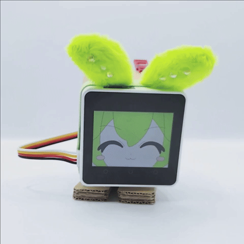

# M5Core2ImageAvatarLite_Zundamon
Zundamon Image Avater for M5Core2ImageAvatarLite<br>
M5Core2ImageAvatarLite、M5Core2ImageAvatarLite_AIで使用できるずんだもんのアバターです。<br>



M5Core2ImageAvatarLiteリポジトリをクローンして、
- zunda_bmp を dataディレクトリに置いてください
- M5AvaterLiteZunda.json をdata/json に置いてください
- data/json/M5AvatarLiteSystem.json の以下の部分を書き換えてください
```JSON
    "avatar_json": [
        ...,
        "/json/M5AvatarLiteZundamon.json"
    ]
```

## 謝辞
ししかわさんが[ｽﾀｯｸﾁｬﾝ](https://github.com/meganetaaan/stack-chan)を、<br>
Takaoさんが[M5Core2ImageAvatarLite](https://github.com/mongonta0716/M5Core2ImageAvatarLite)を、<br>
robo8080さんが[M5Core2ImageAvatarLite_AI](https://github.com/robo8080/M5Core2ImageAvatarLite_AI)を、<br>
それぞれ公開してくださっているおかげで楽しく遊べています！ありがとうございます！


ずんだもん大好き！ありがとう！

## ライセンス
ライセンスはCC-BYです。使用時は私が著作者であることを明記してください。<br>
Xのアカウント([@sayosomi](https://twitter.com/sayosomi))かショップ[さよそみラボ](https://sayosomi.booth.pm/)だと嬉しいです。<br>
[ずんずんPJ キャラクター利用のガイドライン](https://zunko.jp/guideline.html)も守ってください。


ｽﾀｯｸﾁｬﾝ用の枝豆アクセサリーをBOOTHで販売しているのでアバターが気に入ったら買ってください！<br>
[]([URL](https://sayosomi.booth.pm/items/5477533))
